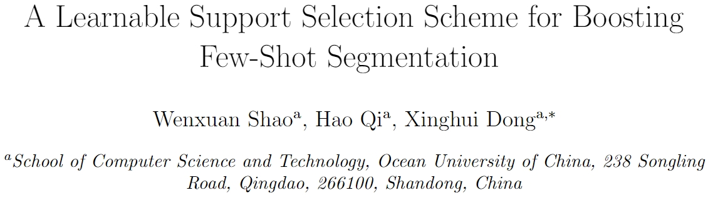
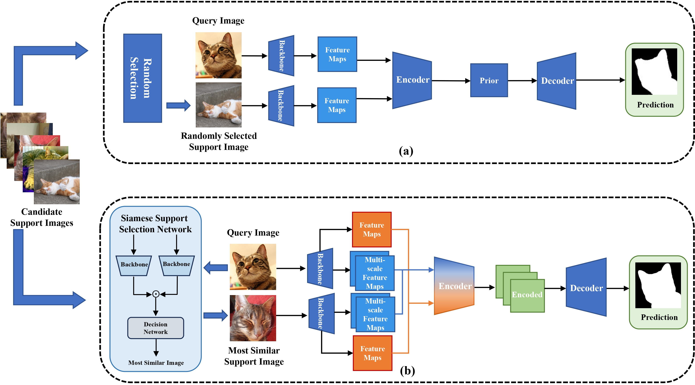
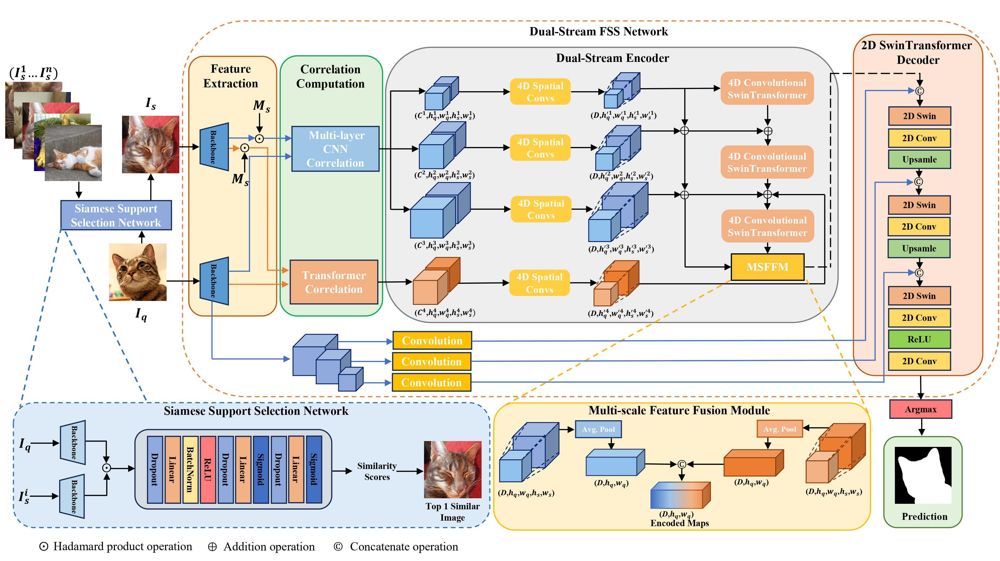
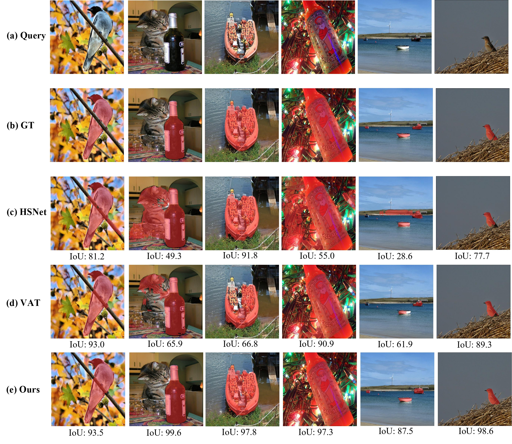

<p align="center"> 
<!-- <a href="" ></a> -->
<a href="./PR.pdf" ></a>
<!-- <a href="" ></a> -->
<!-- <a href="" ></a> -->
</p>

# Support Selection Boosted FSS

# Architecture

## Preparing Few-Shot Segmentation Datasets
Download following datasets:

> #### 1. PASCAL-5<sup>i</sup>
> Download PASCAL VOC2012 devkit (train/val data):
> ```bash
> wget http://host.robots.ox.ac.uk/pascal/VOC/voc2012/VOCtrainval_11-May-2012.tar
> ```
> Download PASCAL VOC2012 SDS extended mask annotations from our [[Google Drive](https://drive.google.com/file/d/10zxG2VExoEZUeyQl_uXga2OWHjGeZaf2/view?usp=sharing)].

> #### 2. COCO-20<sup>i</sup>
> Download COCO2014 train/val images and annotations: 
> ```bash
> wget http://images.cocodataset.org/zips/train2014.zip
> wget http://images.cocodataset.org/zips/val2014.zip
> wget http://images.cocodataset.org/annotations/annotations_trainval2014.zip
> ```
> Download COCO2014 train/val annotations from our Google Drive: [[train2014.zip](https://drive.google.com/file/d/1cwup51kcr4m7v9jO14ArpxKMA4O3-Uge/view?usp=sharing)], [[val2014.zip](https://drive.google.com/file/d/1PNw4U3T2MhzAEBWGGgceXvYU3cZ7mJL1/view?usp=sharing)].
> (and locate both train2014/ and val2014/ under annotations/ directory).

> #### 3. FSS-1000
> Download FSS-1000 images and annotations from our [[Google Drive](https://drive.google.com/file/d/1Fn-cUESMMF1pQy8Xff-vPQvXJdZoUlP3/view?usp=sharing)].

Create a directory '../Datasets_VAT' for the above three few-shot segmentation datasets and appropriately place each dataset to have following directory structure:

    ../                         # parent directory
    └── Datasets_VAT/
        ├── VOC2012/            # PASCAL VOC2012 devkit
        │   ├── Annotations/
        │   ├── ImageSets/
        │   ├── ...
        │   └── SegmentationClassAug/
        ├── COCO2014/           
        │   ├── annotations/
        │   │   ├── train2014/  # (dir.) training masks (from Google Drive) 
        │   │   ├── val2014/    # (dir.) validation masks (from Google Drive)
        │   │   └── ..some json files..
        │   ├── train2014/
        │   └── val2014/
        └── FSS-1000/           # (dir.) contains 1000 object classes
            ├── abacus/   
            ├── ...
            └── zucchini/

# Training

Training on PASCAL-5<sup>i</sup>:

      python train.py --config "config/pascal_resnet{50, 101}/pascal_resnet{50, 101}_fold{0, 1, 2, 3}/config.yaml"

Training on COCO-20<sup>i</sup>:

      python train.py --config "config/coco_resnet50/coco_resnet50_fold{0, 1, 2, 3}/config.yaml"

Training on FSS-1000:

      python train.py --config "config/fss_resnet{50, 101}/config.yaml"

# Evaluation

Result on PASCAL-5<sup>i</sup>:

      python test.py --load "/path_to_pretrained_model/pascal_resnet{50, 101}/pascal_resnet{50, 101}_fold{0, 1, 2, 3}/"

Result on COCO-20<sup>i</sup>:

      python test.py --load "/path_to_pretrained_model/coco_resnet50/coco_resnet50_fold{0, 1, 2, 3}/"

Results on FSS-1000:

      python test.py --load "/path_to_pretrained_model/fss_resnet{50, 101}/"


# Results


